# Mechanic Scheduling App

### Follow Progress: [Notion Kanban Board](https://www.notion.so/Board-1d9a7ae26817816cbafbce6e5ff7c608?pvs=4)

## Services Overview

A cloud-based scheduling application for booking mechanic services. This app uses Google Cloud Platform (GCP) services, a FastAPI backend, and a Next.js SSR frontend to provide a seamless user experience for viewing, selecting, and booking available service slots.

---

## Table of Contents

1. [Overview](#overview)
2. [Technology Stack](#technology-stack)
3. [Prerequisites](#prerequisites)
4. [Architecture](#architecture)
5. [Services](#services)
6. [Infrastructure Provisioning](#infrastructure-provisioning)

---

## Overview

The Mechanic Scheduling App allows users to:

- Browse available services (e.g., oil change, tire rotation).
- Check time-slot availability on a daily calendar grid.
- Book appointments with transactional integrity.
- Receive booking confirmations via email/SMS.
- Sync appointments to Google Calendar.

The application follows a serverless, microservices-inspired design on GCP, leveraging managed services to minimize operational overhead.

---

## Technology Stack

- **Frontend:** Next.js (Server-Side Rendering)
- **Backend:** Python 3.11 + FastAPI
- **Database:** Firestore (Native Mode)
- **Messaging & Tasks:** Cloud Tasks, Eventarc
- **Deployment & IaC:** Terraform, Cloud Build
- **Containers & Registry:** Docker (Distroless images), Artifact Registry
- **Notifications:** SendGrid (Email), Twilio (SMS)
- **Observability:** Cloud Logging, Monitoring, Uptime Checks

---

## Prerequisites

Before you begin, ensure you have installed and configured:

- **gcloud CLI:** Authenticated to your Google account
- **Docker Desktop** (or Podman) running locally
- **Node.js ≥ 18**
- **Python ≥ 3.11** with **Poetry** or **pip‑tools** for dependency management

---

## Architecture

---

## Services

### Frontend (frontend-ssr)

- Built with Next.js in SSR mode
- Pages: `/`, `/services`, `/availability`, `/bookings`
- Data fetched via `getServerSideProps`
- Dockerized for production

### Backend API (backend-api)

- FastAPI application
- Endpoints:
  - `GET /healthz` — Health check
  - `GET /version` — API version
  - `GET /availability` — List free slots
  - `POST /bookings` — Create a booking
- Firestore client wired via environment variables
- Atomic booking logic using Firestore transactions

### Notification Worker

- Pulls tasks from the `notification-tasks` Cloud Tasks queue
- Stub logs payload; later integrates with SendGrid and Twilio

### Google Calendar Sync

- Uses a service account to create calendar events
- Stores `calendar_event_id` in booking documents

---

## Infrastructure Provisioning

All infrastructure is defined and provisioned via Terraform:

1. **Bootstrap**
   - Remote state bucket & state lock table
   - VPC + reserved Firestore location
2. **Core Components**
   - Artifact Registry repositories (`frontend`, `backend`)
   - Cloud Run services:
     - `frontend-ssr` (minInstances=0)
     - `backend-api`  (minInstances=0)
   - Cloud Tasks queue: `notification-tasks`
   - Secret Manager placeholders ( `SENDGRID_KEY`, `TWILIO_SID`, `TWILIO_TOKEN`, etc.)
   - IAM service accounts with least privilege

